# HF Private Operations — admin redesign (before / after)

All screenshots are rendered from the **real admin code** against the local mock-Supabase
harness (`audit/admin-visual/`) using clearly **synthetic fixture data** ("Sample Customer 01",
`@example.invalid`). No production data or credentials appear in these images. The "before" set was
captured from the unmodified code at `d8bd08c` (no screenshot was supplied separately).

| | Before | After |
|---|---|---|
| Dashboard 1440 | 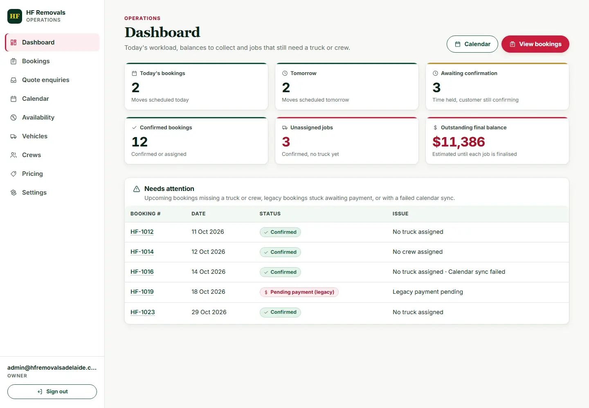 | 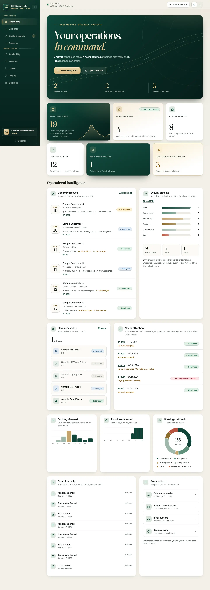 |
| Dashboard dark | — | 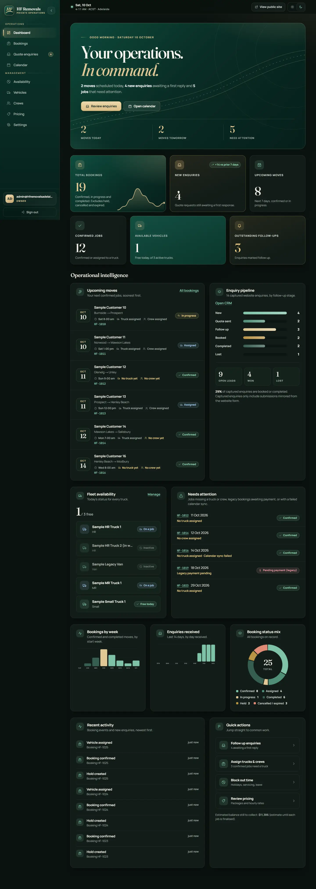 |
| Dashboard 390 | 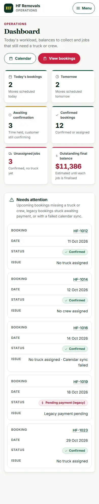 | 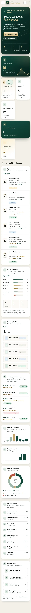 |
| Quote CRM | 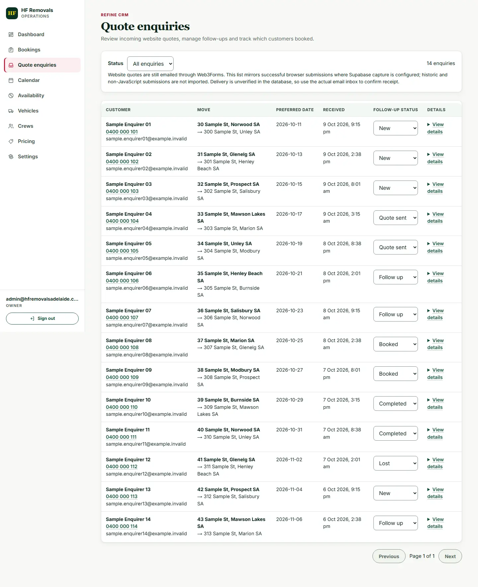 | 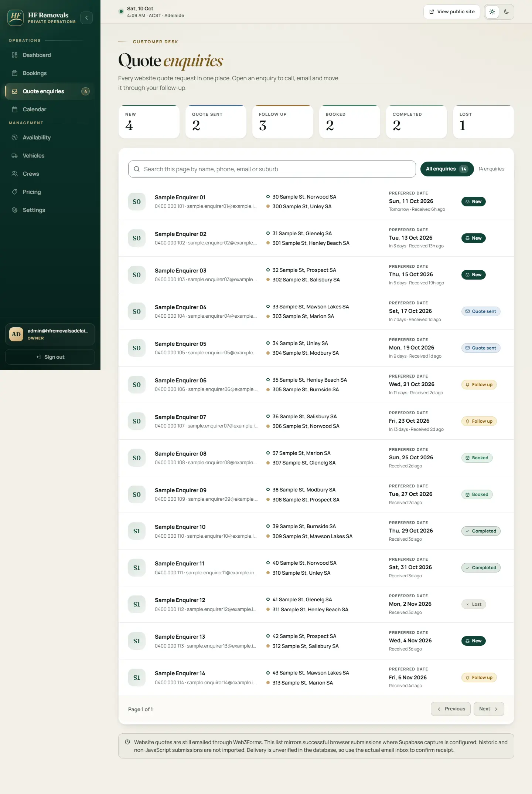 |
| Quote detail drawer | — | 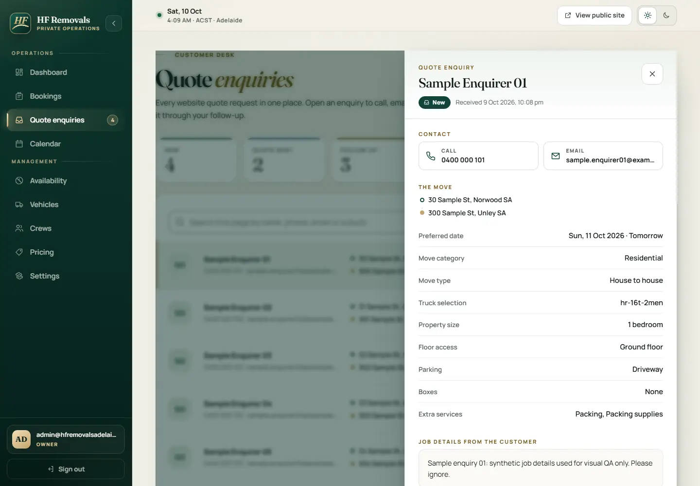 |
| Bookings | — | 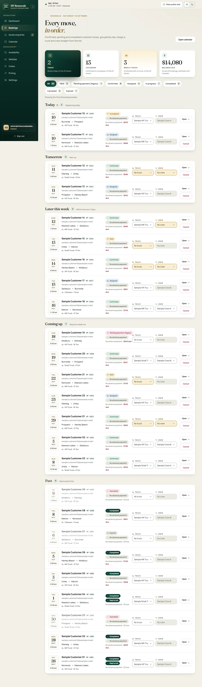 |
| Calendar | — | 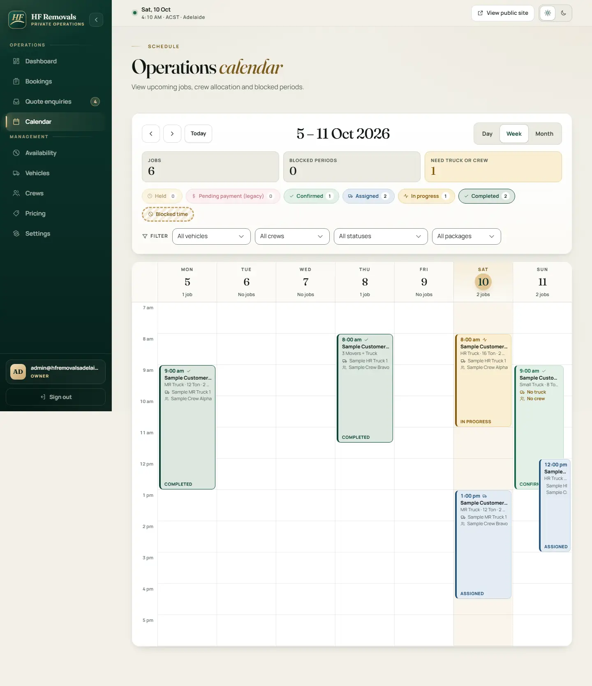 |
| Vehicles | — | 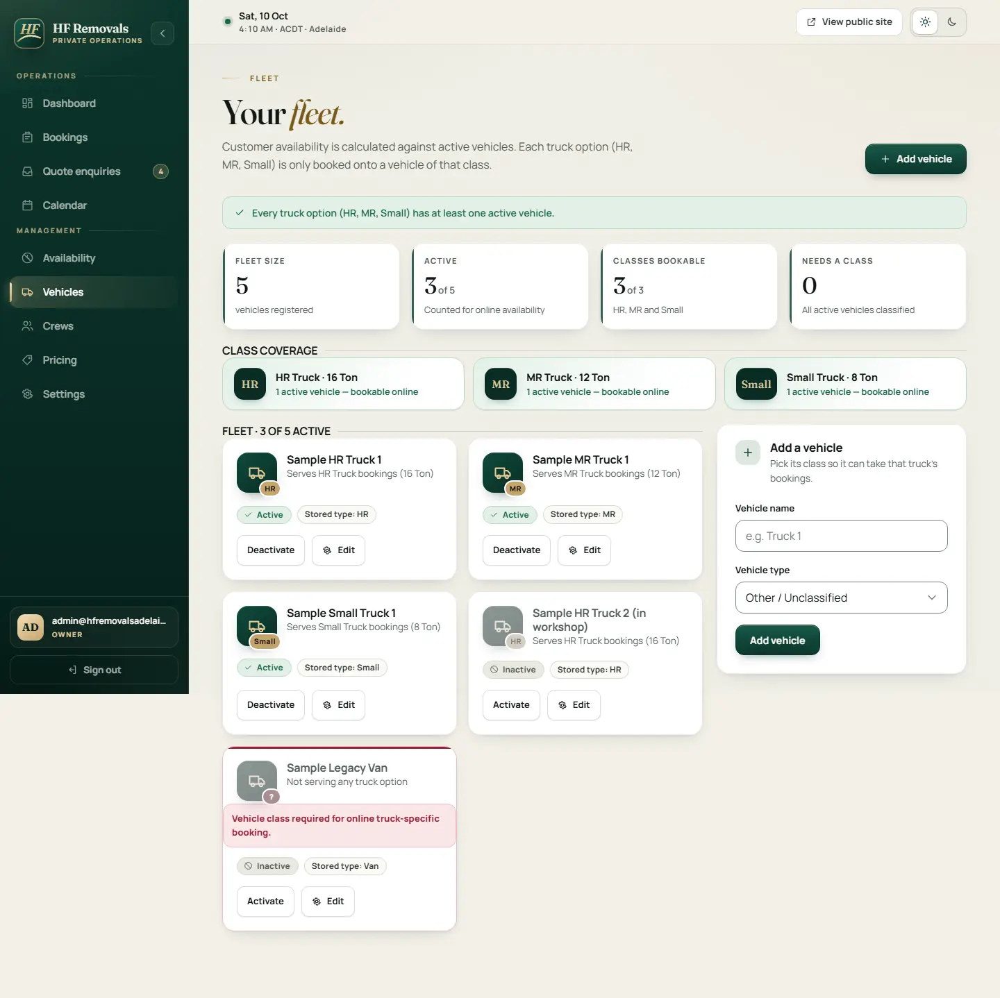 |
| Pricing (dark) | — | 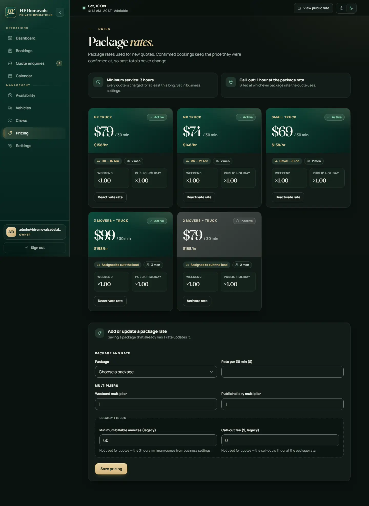 |
| Login | — | 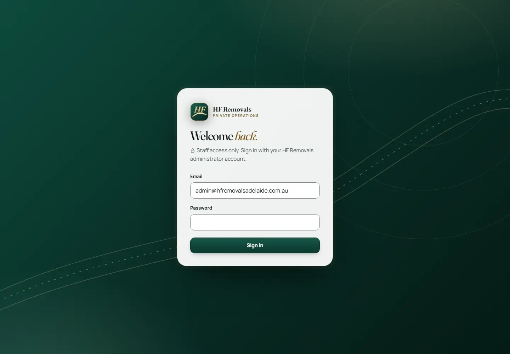 |

Reproduce: `node audit/admin-visual/run-app.mjs --rebuild` then `node audit/admin-visual/shoot.mjs <label> [--theme dark]`.
